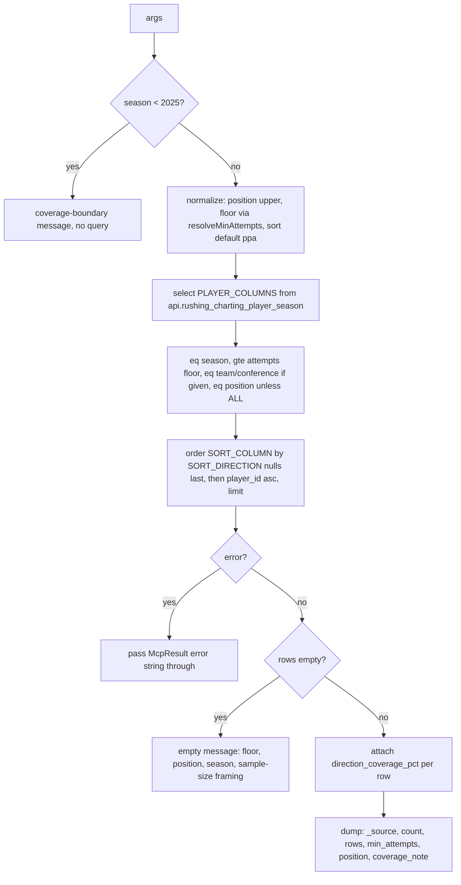

# Rushing Charting Bot Enablement - Plan

## Goal Capsule

- **Objective:** The bot and MCP consumers answer rushing-charting questions ("best RBs in the SEC", "who gets stuffed least", "Oklahoma's run game") from the three `api.rushing_charting_*` views with the right qualifiers attached: a sample-size floor on headline metrics, a 2025-scoped direction-coverage caveat, RB-only by default, NULL never rendered as 0, and no player-to-team reconciliation.
- **Means:** A curated `get_rushing_charting` player leaderboard tool mirroring `get_passing_charting`, plus `run_sql` schema-card entries for all three views and a `search_players` description update (KTD1, KTD7, KTD8).
- **Authority:** Product behavior is owned by the R-IDs below. Implementation mechanism is owned by the KTDs. The cfb-database handoff (`origin_handoff` above) and its companion semantics doc are the source for every coverage number; when this plan and the handoff disagree on a number, the handoff wins.
- **Stop conditions:** Stop and report if `api.rushing_charting_player_season` is missing a column this plan selects, if `position` turns out to be NULL on a material share of RB rows, or if the query layer cannot express an ascending sort with NULLs last.
- **Execution profile:** Five units, all inside cfb-app. No schema changes, no bot code, no UI. Lint, typecheck, and the two new vitest files are the proof.
- **Tail ownership:** The implementer opens the PR. The reply handoff to cfb-database (U5) ships in the same PR.

---

## Product Contract

### Summary

Ship the rushing analogue of the passing-charting work: a `get_rushing_charting` leaderboard tool wired through MCP, the eve agent, and the advisor; three rushing views on the `run_sql` schema card plus a 2026-roster note; and a `search_players` description that names the new `rushing_charting` block on `get_player_detail`. Cache invalidation is documented, not coded. A reply handoff goes back to cfb-database.

### Problem Frame

cfb-database shipped rushing charting on 2026-09-03 and asked for the same bot enablement PR #56 gave passing charting. Rushing has the opposite coverage story: the headline rate metrics are computed over every carry (100% of player rows in 2025 and 2026), so they need a sample-size floor, not a coverage caveat. Direction splits are the partial piece (about 40% of eligible carries resolved in 2025, about 99% in 2026). A tool description copied from passing charting would make the model hedge complete metrics and under-hedge direction. Position mix is the second trap: 2025 has 722 RB, 388 QB, 377 WR, and 55 TE player-seasons, and QB rows fold sacks into `attempts`, so an unfiltered board puts John Mateer (145 carries, 18.3% stuff rate) next to running backs.

### Requirements

**Curated tool**

- R1. `get_rushing_charting` returns one row per (season, player_id, team) from `api.rushing_charting_player_season`, filtered by season, optional team, optional conference, and position.
- R2. `position` defaults to `RB`. The sentinel `ALL` drops the position filter. Matching is case-insensitive on input (`rb`, `all` behave like `RB`, `ALL`).
- R3. `sort` accepts the eleven keys in the table under KTD2. The default is `ppa`. Every sort is descending except `stuff_rate`, which is ascending because lower is better.
- R4. `min_attempts` floors `attempts` server-side before the row cap. The default is 50. The floor the query enforced is echoed back as `min_attempts`, never the value requested.
- R5. `limit` defaults to 25 and is capped at 100. Ties break on `player_id` ascending so equal metrics do not reorder between calls.
- R6. Each row carries `attempts`, `rushing_yards_available`, `direction_eligible_attempts`, `direction_available_attempts`, and a derived `direction_coverage_pct` = `direction_available_attempts / direction_eligible_attempts`, 3dp, null when either side is missing or the denominator is 0.
- R7. The response is `{"_source", "count", "rows", "min_attempts", "position", "coverage_note"}`. `position` echoes the resolved filter (`RB`, `QB`, or `ALL`).
- R8. A season before 2025 returns the coverage-boundary message without querying. An empty result names the floor, the position filter, and the season, and frames the cause as sample size or filter width, never as a charting gap.
- R9. The tool description states, in this order: rate metrics are over every carry so the floor is for sample size, not coverage; the default RB filter and why (QB `attempts` include sacks); direction is about 40% resolved in 2025 and near-complete in 2026; NULL means not charted, never 0; player totals do not reconcile to team totals; 2025 changes only through an explicit cfb-database re-pull.
- R10. Every NULL metric passes through as null. Nothing coerces a NULL rate to 0.

**Surfaces**

- R11. The tool is registered on the MCP server, wrapped in tool telemetry under the name `get_rushing_charting`, exposed to the eve agent, and re-exported to the advisor subagent.
- R12. The `run_sql` schema card gains entries for `api.rushing_charting_player_season`, `api.rushing_charting_team_season`, and `api.rushing_charting_direction_season`, and the `api.roster_lookup` entry states that 2026 rows exist and gives the returning-player join.
- R13. The `search_players` description names the `rushing_charting` block on `get_player_detail`, lists its `directions` keys (`left`, `middle`, `right`, `unknown`), and states that a direction's share is `directions.<dir>.carries / direction_available_attempts` for left/middle/right only, and that `unknown / direction_eligible_attempts` is the coverage gap. It also states that `rushing_charting` is NULL whenever the player-season has no rushing-charting row (every season before 2025, and any 2025+ player with no charted carries), and that NULL is absence of charting, never zero carries.

**Documentation**

- R14. The expansion runbook records the api-view invalidation tuple as the contract for any future rushing-answer cache and records that no such cache exists today.
- R15. A reply handoff to cfb-database lists what shipped, where, and any semantics questions found during implementation.

### Key Decisions

- **Player grain only.** Team run-game identity and direction splits stay on `run_sql`. (session-settled: user-approved — chosen over adding a team grain or side parameter to the tool: the handoff requests the player tool and defers a team direction tool until 2026 has several weeks of data.) Governs R1, R12.
- **No direction sorts in v1.** The 20-carry direction floor from the handoff appears only as the per-row coverage fraction. (session-settled: user-approved — chosen over adding direction sort keys: the player view carries no direction metric columns, and ranking on the direction view is deferred with the direction tool.) Governs R3, R6.
- **Cache invalidation is documentation only.** (session-settled: user-approved — chosen over building a watermark: the bot has no answer cache, only Anthropic prompt caching and config memoization.) Governs R14.
- **A reply handoff is in scope.** (session-settled: user-approved — chosen over replying in an issue: the handoff asked for a doc in either repo, and cfb-app's convention is a top-level `docs/*.md` file.) Governs R15.
- **Default season stays `CURRENT_SEASON`.** The constant is 2025 today, the complete season. `get_season_outlook` resolves `MAX(season)` instead; that pattern is wrong here because it would point a no-argument call at a one-week 2026 board. Governs R8.

### Success Criteria

- The bot answers "who gets stuffed least among SEC backs" with the floor stated and no QB on the board.
- A 2025 direction answer carries "of N charted carries" using `direction_available_attempts`.
- A 2026 request early in the season explains an empty board as not enough carries, not as missing charting.
- A 2025 PPA or success-rate answer states the metric is computed over every carry and carries no charting-coverage hedge.

### Scope Boundaries

- No dashboard UI. MCP and agent surface only, matching passing charting.
- No changes under `bot/src`. The bot reaches new tools through the hosted MCP server automatically.
- No structural enforcement of the non-reconciliation or unknown-share rules inside `run_sql`. Those stay schema-card prose, as they do for passing charting.

#### Deferred to Follow-Up Work

- `get_rushing_direction` team tool over `api.rushing_charting_direction_season` (offense and defense sides), once 2026 has several weeks of data.
- Direction sort keys on the player tool, if a direction metric ever lands on the player view.
- A rushing-answer cache and its watermark, if the bot gains answer caching.
- Bumping `CURRENT_SEASON` to 2026 is owned by the season rollover, not this plan. When that bump lands, the tool's no-argument call moves to an in-progress season where nobody has reached 50 carries for weeks (2026 Week 0 max was 25), so the default `min_attempts` must be re-derived from the then-current `attempts` distribution before the bump, not after. The runbook Watch line in U5 carries this trigger.

### Acceptance Examples

- AE1. Default call
  - **Covers:** R1, R2, R3, R4, R7
  - **Given** no arguments **When** the tool runs **Then** it queries season 2025, `position = 'RB'`, `attempts >= 50`, ordered by `ppa` descending then `player_id`, and echoes `min_attempts: 50` and `position: 'RB'`.
- AE2. Least stuffed
  - **Covers:** R3, R10
  - **Given** `sort: 'stuff_rate'` **When** the tool runs **Then** the primary order is `stuff_rate` ascending with NULLs last, and a row with a NULL `stuff_rate` never leads the board.
- AE3. Pre-charting season
  - **Covers:** R8
  - **Given** `season: 2024` **When** the tool runs **Then** it returns the coverage-boundary message naming 2025 and issues no query.
- AE4. Early-season empty board
  - **Covers:** R8
  - **Given** `season: 2026` in Week 0 (max `attempts` 25) and the default floor **When** the query returns zero rows **Then** the message names the floor (50), the position (RB), and the season, and says to lower `min_attempts` and state the floor used, without describing a charting gap.
- AE5. Position sentinel
  - **Covers:** R2, R7
  - **Given** `position: 'all'` **When** the tool runs **Then** no position filter is applied and the response echoes `position: 'ALL'`.
- AE6. Direction coverage per row
  - **Covers:** R6
  - **Given** a row with `direction_eligible_attempts: 117` and `direction_available_attempts: 26` **When** the tool returns it **Then** `direction_coverage_pct` is 0.222; with `direction_eligible_attempts: 0` it is null.

### Sources

- Work order: `../cfb-database/docs/handoffs/2026-09-03-rushing-charting-bot-enablement.md`.
- Semantics: `../cfb-database/docs/handoffs/2026-09-03-rushing-charting-for-cfb-app.md`; column lists in `../cfb-database/docs/SCHEMA_CONTRACT.md` (2026-09-03 changelog, api table rows for the three views and `get_player_detail`).
- Passing precedent: `src/lib/queries/passing-charting.ts`, `src/lib/mcp/tools.ts` (`get_passing_charting` section), `src/lib/queries/__tests__/passing-charting.test.ts`, `src/lib/mcp/__tests__/passing-charting-tools.test.ts`, commit `5246fde`.
- Sentinel-filter precedent: `get_season_outlook`'s `classification` handling in `src/lib/mcp/tools.ts`.
- Live checks on 2026-09-03 against `api.rushing_charting_player_season`: `rushing_yards_available = attempts` on every row in 2025 and 2026; no NULL `ppa`, `stuff_rate`, or `conference` at 50+ attempts; one NULL `position` row in 2025 (below 50 attempts); 2025 has 376 rows at 50+ attempts and 2026 has 0 (max 25); `position` takes 15 distinct codes.
- Prior learning: `docs/solutions/database-issues/supabase-column-not-found-400-error.md` (PostgREST returns 400 on a column the view does not carry; select only contracted columns).

---

## Planning Contract

### Key Technical Decisions

- KTD1. **New query module `src/lib/queries/rushing-charting.ts` mirrors the passing module's shape with one floor column.** Sort-column map, `positive()` normalization, `resolveMinAttempts()`, a null-preserving `coverage()` helper, server-side `.gte()` before `.limit()`, and the McpResult error-passthrough contract all carry over. Unlike passing, every sort floors on `attempts`, because the live data shows `rushing_yards_available = attempts` on every player row. `rushing_yards_available` is still selected and shipped per row so a future divergence is visible.
- KTD2. **Sort direction is a second map, not a hardcoded flag.** Passing hardcodes `ascending: false`. Rushing needs a per-sort direction so `stuff_rate` can sort ascending. Pass `nullsFirst: false` on every primary order so NULLs sit last in both directions. The tiebreak `.order('player_id', { ascending: true })` follows the primary order. Sort keys:

| `sort` | Column | Direction |
|---|---|---|
| `ppa` (default) | `ppa` | DESC |
| `success_rate` | `success_rate` | DESC |
| `explosiveness` | `explosiveness` | DESC |
| `ypc` | `yards_per_carry` | DESC |
| `stuff_rate` | `stuff_rate` | ASC |
| `power_success` | `power_success` | DESC |
| `yards` | `total_rushing_yards` | DESC |
| `attempts` | `attempts` | DESC |
| `line_yards` | `line_yards` | DESC |
| `second_level_yards` | `second_level_yards` | DESC |
| `open_field_yards` | `open_field_yards` | DESC |

- KTD3. **Position is a free string normalized to uppercase, with `ALL` as the drop-filter sentinel.** The view carries 15 position codes, so a zod enum would be wrong. The tool uppercases the input, treats `ALL` as no filter, and applies `.eq('position', code)` otherwise. The description documents `ALL` in uppercase to match the handoff; lowercase input still works. This differs from `get_season_outlook`'s lowercase enum sentinel because that field is a closed set of five values.
- KTD4. **Two messages, both bespoke.** Pre-2025 reuses the coverage-boundary shape and `CHARTING_MIN_SEASON` from `passing-charting.ts`. The empty-result message is written from scratch: it names floor, position, and season, offers "no rusher in this slice has reached N carries yet, or the filter is too narrow", and tells the model to lower `min_attempts` and say so. It must not reuse passing's "only ~407 have anything charted" framing.
- KTD5. **`coverage_note` is rushing-specific.** It states that rate metrics are averaged over every carry, that `direction_coverage_pct` is the only partial figure and must accompany any direction claim, that NULL is not 0, and that player `attempts` do not sum to team `offense_attempts`.
- KTD6. **The 40% direction figure is 2025-scoped in the description.** The description says "about 40% of eligible carries resolved in 2025; near-complete same-day in 2026" so a 2026 answer does not inherit a stale hedge. The per-row `direction_coverage_pct` is the arbiter regardless of prose. The figure is a snapshot: the runbook's Watch tuple (U5) names the tool description and the schema-card entries as its consumer, and a move in 2025's `direction_available_attempts` means re-deriving the figure and updating both in the same PR.
- KTD7. **Schema-card entries use the handoff's draft text, terminology aligned to the tool.** Insert the three entries directly after the `api.passing_charting_team_season` entry, before `api.refresh_campaign_status`. Denominator names (`direction_eligible_attempts`, `direction_available_attempts`) must match the tool's row fields exactly. The unknown-share rule lives on the direction-view entry and the `search_players` description only; the leaderboard tool never exposes an `unknown` row.
- KTD8. **No registry edits.** The eve agent auto-discovers `agent/tools/*.ts` by filename; the advisor does the same under `agent/subagents/advisor/tools/`. `withToolTelemetry` is keyed by string with no enum. The only code wiring is `registerMcpTools`. While in `src/lib/mcp/tools.ts`, correct the stale "twenty-five tools" header comments to the actual count, and make the matching edit in `docs/MCP.md` (U5), which carries the same stale count and names the app-native tools individually.
- KTD9. **Docs follow cfb-app conventions.** The reply handoff is `docs/RUSHING_CHARTING_HANDOFF.md` (top-level `docs/*.md`, as `docs/WAREHOUSE_EXPANSION_HANDOFF.md`), not a `docs/handoffs/` directory. The runbook gains a "Stage 5 — rushing charting" section in the Stage 1 shape (what cfb-database shipped, what cfb-app ships, *Watch*, *Done when*) carrying the invalidation tuple. `CLAUDE.md`'s api-view list gains the three views.

### High-Level Technical Design

Request path for the curated tool. Prose in the KTDs is authoritative where the two differ.

### Assumptions

- `api.rushing_charting_player_season` exposes `conference` and `position` as documented in the schema contract and confirmed live on 2026-09-03.
- PostgREST honors `nullsFirst: false` on an ascending order the same way it does on descending.

### Sequencing

U1 first (query module and its tests). U2 and U3 both edit `src/lib/mcp/tools.ts`; do U2 before U3 so the description and card can cross-reference the tool name. U4 depends on U2's exports. U5 is independent of code but should be written last so it reports what shipped.

---

## Implementation Units

### U1. Query module for rushing charting

- **Goal:** A `queryRushingChartingPlayers` function with the floor, sort, position, and coverage semantics of R1 to R6 and R10.
- **Requirements:** R1, R2, R3, R4, R5, R6, R10
- **Dependencies:** none
- **Files:**
  - Create `src/lib/queries/rushing-charting.ts`
  - Create `src/lib/queries/__tests__/rushing-charting.test.ts`
- **Approach:**
  1. Export `DEFAULT_MIN_ATTEMPTS = 50`, the `RushingChartingSort` union, `resolveMinAttempts()`, `resolvePosition()` (uppercase, `ALL` sentinel), the row interface, and the filter interface. Import `CHARTING_MIN_SEASON` from `passing-charting.ts` rather than redefining it.
  2. Select exactly the contracted columns (KTD1): season, player_id, player, team, conference, position, attempts, rushing_yards_available, direction_eligible_attempts, direction_available_attempts, total_rushing_yards, yards_per_carry, success_rate, ppa, total_ppa, stuff_rate, power_success, explosiveness, line_yards, second_level_yards, open_field_yards, and the three `*_total` yardage columns.
  3. Build the chain per KTD2: `.gte('attempts', floor)` before `.limit()`, `.eq('position', code)` unless the sentinel, primary `.order()` from the direction map with `nullsFirst: false`, then the `player_id` tiebreak.
  4. Map rows through a `withDirectionCoverage()` helper that derives `direction_coverage_pct` (R6).
  5. Module header comment explains why the floor is `attempts` for every sort, why the default season is `CURRENT_SEASON` and not `MAX(season)`, and that the module is MCP-only and not wrapped in React `cache()`.
- **Patterns to follow:** `src/lib/queries/passing-charting.ts` (structure, `positive()`, `coverage()`, McpResult contract); `src/lib/queries/mcp.ts` for `fail` and `clamp`.
- **Test scenarios:**
  - Default call floors `attempts` at 50, applies `.eq('position', 'RB')`, orders `ppa` descending with `nullsFirst: false`, then `player_id` ascending, and calls `.limit(25)`. Covers AE1.
  - `sort: 'stuff_rate'` orders `stuff_rate` ascending with `nullsFirst: false`. Covers AE2.
  - Each of the other nine sort keys orders its mapped column descending (table-driven).
  - `position: 'all'` and `position: 'ALL'` skip the position `.eq()`; `position: 'qb'` applies `.eq('position', 'QB')`. Covers AE5.
  - `team` and `conference` filters pass through as `.eq()` calls; omitted filters add no call.
  - `minAttempts: 0` and `limit: -5` fall back to 50 and 25.
  - `direction_coverage_pct` is 0.222 for 26/117 and null when eligible is 0 or either side is null. Covers AE6.
  - A NULL `ppa` on an input row stays null on the output row.
  - A PostgREST error returns `rows: []` and an error string starting with `Error: api.rushing_charting_player_season`, never a throw.
- **Verification:** The new test file passes; typecheck passes; `contract-guard.test.ts` still passes (module only uses `.schema('api')`).

### U2. Curated tool, telemetry, and MCP registration

- **Goal:** `get_rushing_charting` exists on the MCP server with the description, input shape, messages, and envelope of R7 to R11.
- **Requirements:** R2, R4, R7, R8, R9, R10, R11
- **Dependencies:** U1
- **Files:**
  - Modify `src/lib/mcp/tools.ts` (new numbered section 29 after `get_coach_tenure`, telemetry export, `registerMcpTools` entry, header comment count)
  - Create `src/lib/mcp/__tests__/rushing-charting-tools.test.ts`
- **Approach:**
  1. `GetRushingChartingArgs` with `season`, `team`, `conference`, `position`, `sort`, `min_attempts`, `limit`.
  2. Impl: pre-2025 guard first (KTD4), then query, then error passthrough, then the empty message (KTD4), then `dump()` with `wrap('api.rushing_charting_player_season', rows)`, `min_attempts` from `resolveMinAttempts`, `position` from `resolvePosition`, and the `coverage_note` (KTD5).
  3. Description per R9 and KTD6, including the phrase that results are floored at `DEFAULT_MIN_ATTEMPTS` carries by default and that the floor is echoed as `min_attempts`.
  4. Input shape: `season` int optional; `team`, `conference` strings; `position` string optional describing the `RB` default, the QB-sacks caveat, and the `ALL` sentinel; `sort` as a zod enum of the eleven keys noting `stuff_rate` is ascending; `min_attempts` int `.min(1)`; `limit` int 1 to `DEFAULT_ROW_CAP`.
  5. `export const getRushingChartingTool = withToolTelemetry('get_rushing_charting', impl)` next to the passing exports; register with `READ_ONLY_ANNOTATIONS` and title "Get Rushing Charting".
  6. Update the two "twenty-five tools" header comments to the real count (KTD8).
- **Patterns to follow:** `getPassingChartingToolImpl`, `getPassingChartingDescription`, `getPassingChartingInputShape`, and the `get_season_outlook` empty-result hint that echoes the applied filter.
- **Test scenarios:**
  - Envelope carries `_source`, `count`, `rows`, `min_attempts: 50`, `position: 'RB'`, and a `coverage_note` matching /every carry/ and /direction_coverage_pct/. Covers AE1.
  - `min_attempts: 0` from a direct caller echoes 50; `min_attempts: 20` echoes 20.
  - `position: 'all'` echoes `position: 'ALL'` and passes the raw `'all'` through to the query, which owns the sentinel (U1). Covers AE5.
  - Filters pass through to the query layer as `{ season, team, conference, position, minAttempts, sort, limit }`.
  - `season: 2024` returns text matching /starts in 2025/ and /coverage boundary/ and never calls the query. Covers AE3.
  - Empty rows return text naming the floor, the position, and the season, matching /carries/ and not matching /charted/ in the causal clause. Covers AE4.
  - A query-layer error string is returned unchanged.
  - A row with `ppa: null` appears in the JSON as `null`.
  - The description contains the six R9 claims in order (assert relative indices of "every carry", "RB", "40%", "NULL", "reconcile", "re-pull").
- **Verification:** New test file passes; the MCP route still compiles; a manual call through the hosted server or the eve agent for season 2025, team Oklahoma, `min_attempts: 20` returns Oklahoma backs with `direction_coverage_pct` populated; the ascending-sort live smoke in the Verification Contract shows NULL `stuff_rate` rows last.

### U3. Schema card and search_players description

- **Goal:** `run_sql` and `search_players` carry the rushing context of R12 and R13.
- **Requirements:** R12, R13
- **Dependencies:** U2
- **Files:**
  - Modify `src/lib/mcp/tools.ts` (schema card block; `searchPlayersDescription`; `api.roster_lookup` entry)
  - Modify `src/lib/mcp/__tests__/rushing-charting-tools.test.ts` (schema-card assertions, if the card text is exported or reachable through the `run_sql` description)
- **Approach:**
  1. Insert the three view entries from the handoff's draft text after the `api.passing_charting_team_season` entry (KTD7), each ending with a "Prefer the get_rushing_charting tool" pointer for the player view only.
  2. Append to `api.roster_lookup`: 2026 rows present as of 2026-09-03; returning-player join is `r.id = p.player_id AND r.team = p.team AND r.year = 2026`; both ids are text.
  3. Extend `searchPlayersDescription` with one sentence on the `rushing_charting` jsonb block (headline metrics, three denominators, attribution counters, `directions` keys), the share rule from R13, and the closing clause that the block is NULL when the player-season has no charting row and that NULL is never zero carries.
- **Patterns to follow:** The passing-charting entries immediately above the insertion point; the `api.core_ratings` entry's "NULL means not rated, never 0" phrasing.
- **Test scenarios:**
  - The `run_sql` description (or exported schema card) contains all three view names and the string `direction_available_attempts`.
  - The `search_players` description contains `rushing_charting`, `directions`, `direction_available_attempts`, and the NULL-means-no-charting-row clause.
  - If neither text is reachable from a test, record `Test expectation: none -- prose-only change verified by review`.
- **Verification:** Typecheck passes; a `run_sql` call from the eve agent asking for team run-game identity produces the offense-side query shape from the handoff without a player-share computation.

### U4. Agent and advisor tool files

- **Goal:** The eve agent and advisor subagent can call the tool (R11).
- **Requirements:** R11
- **Dependencies:** U2
- **Files:**
  - Create `agent/tools/get_rushing_charting.ts`
  - Create `agent/subagents/advisor/tools/get_rushing_charting.ts`
- **Approach:** Copy the eleven-line `defineTool` shape from `agent/tools/get_passing_charting.ts`, importing `getRushingChartingTool`, `getRushingChartingInputShape`, and `getRushingChartingDescription`. The advisor file is the two-line default re-export.
- **Patterns to follow:** `agent/tools/get_passing_charting.ts`, `agent/subagents/advisor/tools/get_passing_charting.ts`.
- **Test scenarios:** Test expectation: none -- two-line wiring files with no logic; the tool impl is covered in U2.
- **Verification:** Typecheck passes; the agent's tool list at startup includes `get_rushing_charting` (eve discovers by filename).

### U5. Runbook stage, reply handoff, and CLAUDE.md

- **Goal:** The invalidation contract, the shipped surface, and the reply to cfb-database are recorded (R14, R15).
- **Requirements:** R14, R15
- **Dependencies:** U1 to U4 complete
- **Files:**
  - Modify `docs/WAREHOUSE_EXPANSION_RUNBOOK.md` (new "Stage 5 — rushing charting")
  - Create `docs/RUSHING_CHARTING_HANDOFF.md`
  - Modify `CLAUDE.md` (add the three views to the `api` schema examples and key views lines)
  - Modify `docs/MCP.md` (tool count and app-native tool enumeration)
- **Approach:**
  1. Runbook stage in the Stage 1 shape: cfb-database shipped views 050 to 052 and the `get_player_detail` column; cfb-app ships `get_rushing_charting` plus `src/lib/queries/rushing-charting.ts`; *Watch:* the invalidation tuple from the handoff (SUM of `attempts`, `direction_available_attempts`, `direction_eligible_attempts` per season from `api.rushing_charting_player_season`), with the note that no answer cache exists and load ids must never be the watermark. The tuple's consumer today is the "about 40% in 2025" figure in `getRushingChartingDescription` and the three schema-card entries: when 2025's `direction_available_attempts` moves (first expected at the ~2026-09-07 re-pull), re-derive the figure from the new tuple and update both in the same PR (KTD6). Second Watch line: before `CURRENT_SEASON` bumps to 2026, re-derive `DEFAULT_MIN_ATTEMPTS` from that season's live `attempts` distribution so the no-argument call does not return an empty board for weeks; *Done when:* the success criteria above.
  2. Reply handoff: what shipped and where, the tool's input and envelope, the two floors used, the 2025 vs 2026 direction split as stated in the description, and a request for the ~2026-09-07 re-pull date so the "provisional" wording can be revisited.
  3. `CLAUDE.md`: one line each for the three views in the api examples and a short note that `api.rushing_charting_*` rate metrics are full-coverage and `defense_*` is the team's own run defense.
  4. `docs/MCP.md`: change "All twenty-five tools" to twenty-nine, "17 further app-native tools" to 21, and add `get_rushing_charting` to that enumeration (KTD8).
- **Patterns to follow:** `docs/WAREHOUSE_EXPANSION_RUNBOOK.md` Stage 1; `docs/WAREHOUSE_EXPANSION_HANDOFF.md` for the outbound-handoff shape.
- **Test scenarios:** Test expectation: none -- documentation only.
- **Verification:** The runbook's stage list is contiguous; the handoff links resolve; `CLAUDE.md` still reads as one document.

---

## Verification Contract

| Check | Command | Applies to |
|---|---|---|
| Lint | `npm run lint` | all units |
| Types | `npm run typecheck` | all units |
| Unit tests | `npm run test` | U1, U2, U3 |
| Query-layer proof | `src/lib/queries/__tests__/rushing-charting.test.ts` passes | U1 |
| Tool-layer proof | `src/lib/mcp/__tests__/rushing-charting-tools.test.ts` passes | U2, U3 |
| Contract guard | `src/lib/queries/__tests__/contract-guard.test.ts` passes | U1 |
| Live smoke | Call the tool for season 2025, team Oklahoma, `min_attempts: 20`; expect Oklahoma RBs, `direction_coverage_pct` populated, `position: 'RB'` echoed | U2, U4 |
| Live smoke, ascending sort | Call the tool for season 2025 with `sort: 'stuff_rate'`, `position: 'ALL'`, and `min_attempts: 1` so NULL `stuff_rate` rows fall in range; expect the board ordered ascending with every NULL row last | U2 |

The pre-push hook runs lint and typecheck only. Run the test suite before pushing.

---

## Definition of Done

- All five units landed in one PR on a `feature/` branch.
- Lint, typecheck, and the full vitest suite pass.
- The live smoke call returns Oklahoma backs with the envelope fields of R7.
- The tool description contains the six R9 claims in order.
- No `.schema('core')` usage introduced; no changes under `bot/src`.
- The reply handoff exists and the runbook has the rushing stage.
- No abandoned experiments remain in the diff.
