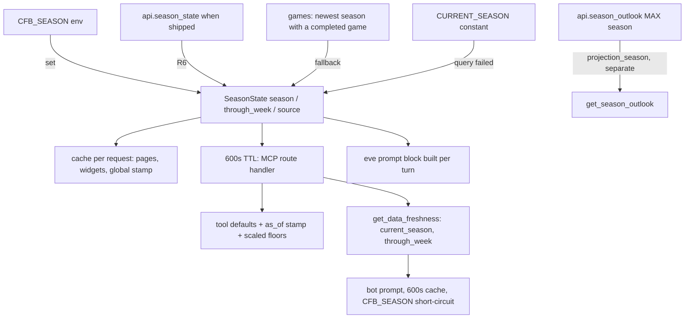

# Season Rollover - Plan

## Goal Capsule

- **Objective:** Every surface of cfb-app (dashboard, MCP tools, eve agent, Discord bot) answers for the same season, and that season follows the data: the live 2026 season today, the last completed season in the offseason, with no yearly constant bump and no early-season empty boards.
- **Means:** One warehouse-driven `getCurrentSeason()` resolver replacing the hardcoded `CURRENT_SEASON` default (KTD1), scaled charting floors during a live season (KTD5), and an `as_of` stamp on every season-defaulted answer (KTD6).
- **Authority:** Product behavior is owned by the R-IDs below. Implementation mechanism is owned by the KTDs. The Key Decisions were settled in a design interview on 2026-09-04 and are annotated as such; do not reopen them.
- **Stop conditions:** Stop and report if `public.games` stops carrying a `completed` flag, if the MCP route handler cannot hold a module-level cache across requests, or if the bot's prompt build cannot make one MCP call per ten minutes.
- **Execution profile:** Two PRs. PR 1 (U1 to U6) fixes the live contradiction between the bot and the tools. PR 2 (U7, U8) moves pages and widgets and adds the global stamp. Lint, typecheck, and the test suite are the proof; the bot's own suite runs under `bot/`.
- **Tail ownership:** The implementer opens each PR. The cfb-database work order (U6) ships in PR 1.

---

## Product Contract

### Summary

Replace the hardcoded `CURRENT_SEASON` with a resolver that returns the newest season with at least one completed game, cached per request for pages and for ten minutes in the MCP route and the bot. Scale the three charting floors by weeks played during the live season. Stamp every season-defaulted response with the season and week it covers. Retire the bot's calendar rule in favor of the same resolver, and ask cfb-database for an `api.season_state` view so the definition lives with the data.

### Problem Frame

`CURRENT_SEASON` is still 2025 in Week 2 of 2026. The Discord bot already rolled over on its own August-pivot calendar rule, so its prompt says 2026 while every tool it calls defaults to 2025 and every tool description says "Defaults to 2025". A user asking "best RBs" gets last season's board with this season's framing. Bumping the constant would fix the year and break the floors: no 2026 rusher has 50 carries after Week 1, so every charting leaderboard would return an empty board for weeks. Meanwhile `get_season_outlook` resolves its own season from data, `/games` and `/teams` use "any season with rows" (which already includes the fully loaded 2026 schedule), and the agent's system prompt bakes the year in at build time. There are four definitions of "current" in production and none of them is the data's.

### Requirements

**Resolver**

- R1. `getCurrentSeason()` returns the newest season in `public.games` that has at least one game with `completed = true`. A season with only scheduled games does not count.
- R2. The resolver also returns `through_week`: the highest completed week of that season.
- R3. When the `CFB_SEASON` environment variable is set to an integer, the resolver returns it unchanged and reports `source: 'override'`.
- R4. When the query fails, the resolver returns `CURRENT_SEASON` from `constants.ts` and reports `source: 'fallback'`; it never throws.
- R5. In a React Server Component render the resolver is deduplicated per request. In the MCP route handler and the bot it is cached for ten minutes.
- R6. When `api.season_state` exists in the warehouse the resolver reads it instead of `games`; the `games` query stays as the second fallback.

**Tools and agent**

- R7. Every MCP tool that defaults `season` uses the resolver, and its description says "defaults to the current season" without a year.
- R8. Every season-defaulted tool response carries `as_of: {season, through_week, source}`.
- R9. `get_data_freshness` returns `current_season` and `through_week` alongside the existing freshness rows.
- R10. The eve agent's system prompt states the resolved season and week at prompt-build time, not a compiled constant.
- R11. `get_season_outlook` keeps resolving the season being projected from its own view; that value is named `projection_season` in code and in its description and is never sourced from the current-season resolver.

**Floors**

- R12. During the live season, the default floors of `get_rushing_charting`, `get_passing_charting`, and `get_target_profile` scale as `max(10, ceil(default × through_week / 12))`. A completed past season uses the full default.
- R13. An explicit caller floor always wins over scaling. The response echoes the enforced floor, as today.
- R14. The empty-result messages of those tools state the resolved season and week and the scaled floor.

**Bot**

- R15. The bot derives its default season from the MCP server's `get_data_freshness` response, cached for ten minutes, and no longer from a calendar rule.
- R16. The bot omits `season` on tool calls unless the user named one; `CFB_SEASON` remains its override with the same semantics as the app's.

**Pages**

- R17. Dashboard widgets and pages that default the season use the resolver. `/games` and `/teams` stop defaulting to `availableSeasons[0]`.
- R18. The app shows one global "Through Week N, YYYY" stamp sourced from the resolver; per-widget season labels are unchanged.

**Documentation**

- R19. A work order to cfb-database defines `api.season_state` (season, completed games, `through_week`, `is_complete`) and the runbook gains a stage for it.

### Key Decisions

- **Warehouse-driven resolver.** (session-settled: user-directed — chosen over keeping a yearly constant bump and over a calendar rule: the data already knows which season is loaded, and the app was a year stale during a live season.) Governs R1, R4, R6.
- **One resolver, one answer everywhere.** (session-settled: user-directed — chosen over per-surface definitions of "current": two definitions are how the bot contradicts the dashboard.) Governs R7, R10, R15, R17.
- **Completed games define "loaded".** (session-settled: user-directed — chosen over "any rows": the full 2026 schedule was loaded before kickoff, so any-rows would flip in spring.) Governs R1.
- **Offseason resolves to the last completed season.** (session-settled: user-directed — chosen over showing the upcoming season once its schedule loads, on every surface including `/games`.) Governs R1, R17.
- **Floors scale by weeks played on the live season only.** (session-settled: user-directed — chosen over fixed floors with "too early" messages and over silent fallback to the prior season, which produces confident wrong answers.) Governs R12, R13.
- **Projection season is a separate concept.** (session-settled: user-directed — chosen over routing `get_season_outlook` through the resolver.) Governs R11.
- **`CFB_SEASON` is the single manual brake.** (session-settled: user-directed — chosen over an admin UI or `app_settings` entry; the bot already reads this name.) Governs R3, R16.
- **The bot learns the season from the server.** (session-settled: user-directed — chosen over keeping the bot's calendar rule or inferring from tool stamps.) Governs R15, R16.
- **Global stamp, not per widget.** (session-settled: user-directed — chosen over per-widget stamps.) Governs R18.
- **Two PRs, no constant bump first.** (session-settled: user-directed — chosen over one big PR and over a stopgap bump, which would empty every early-season board.) Governs the unit split below.
- **Ask cfb-database for `api.season_state` now.** (session-settled: user-directed — chosen over staying on the app-side query indefinitely.) Governs R6, R19.

### Success Criteria

- The bot answers "best RBs" with 2026 through Week N stated, a scaled floor named, and no empty board.
- The dashboard header and every tool response agree on season and week for the same request.
- Unsetting `CFB_SEASON` and rerunning produces the same season; setting it pins every surface.
- No file outside `constants.ts` imports `CURRENT_SEASON` after PR 2.

### Scope Boundaries

- No change to `getCurrentWeek`/`getDefaultWeek`; week is already data-driven.
- No change to the season selector on pages; users can still pick any season.
- No new dashboard widget; the stamp reuses the sidebar's existing "data updated" slot.

#### Deferred to Follow-Up Work

- Swapping the resolver's source to `api.season_state` once cfb-database ships it (R6 is written to make that a one-line change).
- Scaling any floor beyond the three charting ones.
- Letting schedule pages opt into the upcoming season during the preseason window.

### Acceptance Examples

- AE1. Live season
  - **Covers:** R1, R2, R12
  - **Given** `games` has 2026 rows with completed games through week 1 **When** `get_rushing_charting` runs with no arguments **Then** it queries season 2026, floors `attempts` at `max(10, ceil(50 × 1 / 12)) = 10`, and returns `as_of: {season: 2026, through_week: 1, source: 'games'}`.
- AE2. Offseason
  - **Covers:** R1
  - **Given** the 2027 schedule is loaded with zero completed games **When** the resolver runs **Then** it returns 2026 with `through_week` at 2026's final completed week.
- AE3. Override
  - **Covers:** R3
  - **Given** `CFB_SEASON=2025` **When** any surface resolves the season **Then** it is 2025 with `source: 'override'` and no query runs.
- AE4. Explicit floor
  - **Covers:** R13
  - **Given** a live season at week 1 and `min_attempts: 30` **When** the tool runs **Then** the floor is 30, not 10.
- AE5. Query failure
  - **Covers:** R4
  - **Given** the `games` query errors **When** the resolver runs **Then** it returns `CURRENT_SEASON` with `source: 'fallback'` and the tool still answers.
- AE6. Projection season untouched
  - **Covers:** R11
  - **Given** the resolver returns 2026 **When** `get_season_outlook` runs with no season **Then** it still uses `MAX(season)` from `api.season_outlook`.

### Sources

- Usage map (2026-09-04): ~49 `CURRENT_SEASON` sites; ~24 in `src/app` and `src/components`, ~40 tool defaults in `src/lib/mcp/tools.ts`, the agent prompt at `src/lib/agent/prompts.ts:70-74`, zero in `bot/`.
- Bot calendar rule and override: `bot/src/config.ts` (`deriveDefaultSeason`, `CFB_SEASON`, `getDefaultSeason`), used by `bot/src/claude.ts` and eight command files.
- Existing data-driven resolution: `getAvailableSeasons`, `getCurrentWeek`, `getDefaultWeek` in `src/lib/queries/games.ts`; `queryLatestOutlookSeason` in `src/lib/queries/season-outlook.ts`.
- Live warehouse check (2026-09-04): 2026 has 3,680 games loaded and 173 completed through week 1; `get_available_seasons` already returns 2026 first; 2025 completed through week 16.
- Freshness plumbing: `getDataFreshness` in `src/lib/queries/dashboard.ts`, `get_data_freshness` tool section 8 in `src/lib/mcp/tools.ts`, `dataUpdatedLabel` passed to `Sidebar` from `src/app/layout.tsx`.
- 32 test files under `src/lib/mcp/__tests__` and `src/lib/queries/__tests__` mention 2025; most through tool defaults.

---

## Planning Contract

### Key Technical Decisions

- KTD1. **New module `src/lib/queries/season.ts` owns resolution.** It exports `getCurrentSeason(): Promise<SeasonState>` where `SeasonState = {season, through_week, source: 'override' | 'season_state' | 'games' | 'fallback'}`, plus `resolveSeasonSync` helpers for tests. Order of resolution: `CFB_SEASON` env, `api.season_state` (when present; R6), the `games` query (`SELECT season, MAX(week) FROM games WHERE completed GROUP BY season ORDER BY season DESC LIMIT 1`), then `CURRENT_SEASON`. Read the env var once at module load.
- KTD2. **Two cache wrappers, one implementation.** `getCurrentSeasonCached` uses React `cache()` for RSC callers (pages, widgets). `getCurrentSeasonForRoute` uses a module-level `{value, expiresAt}` with a 600-second TTL for the MCP route handler, matching `mcp.ts`'s rule that route-handler code never uses `cache()`. Both call the same resolver.
- KTD3. **Tools resolve at call time, not import time.** Every `args.season ?? CURRENT_SEASON` in `tools.ts` becomes `args.season ?? (await getCurrentSeasonForRoute()).season`. Descriptions replace `Defaults to ${CURRENT_SEASON}` with "Defaults to the current season". The `search`/`wrap`/`dump` envelope gains an `as_of` field appended by one helper, `withAsOf(payload, state)`, so tools cannot drift on the stamp's shape.
- KTD4. **The agent prompt resolves at build time of the prompt, not the bundle.** `src/lib/agent/prompts.ts` exports a function that takes `SeasonState` and returns the block; `agent/instructions/*` calls it per turn the way `30-lore.ts` already resolves lore per turn.
- KTD5. **Floor scaling is one shared function.** `scaleFloor(defaultFloor, state)` in `season.ts` returns `defaultFloor` unless `state.season` is the live season (a season with an incomplete schedule, derived in the same query), in which case it returns `max(10, ceil(defaultFloor × through_week / 12))`. `resolveMinAttempts` and both `resolveMinCharted` functions take the state and apply it only when the caller passed no floor. The empty messages (R14) print the scaled value.
- KTD6. **`as_of` is the contract.** Shape `{season: number, through_week: number, source: string}`. Tests assert it on every season-defaulted tool through one shared test helper that iterates the registry.
- KTD7. **`get_data_freshness` grows two fields, not a new tool.** The RPC rows stay; the tool's JSON adds `current_season` and `through_week` from the resolver. The bot reads those.
- KTD8. **Bot: replace the rule, keep the override.** `deriveDefaultSeason` becomes `fetchDefaultSeason()` that calls the hosted MCP `get_data_freshness` through the existing connector, caches for 600 seconds, and falls back to the old August rule only when the call fails (so the bot never has no season). `getDefaultSeason()` keeps its signature; its eight command callers do not change. `CFB_SEASON` short-circuits before the call.
- KTD9. **`projection_season` rename.** `queryLatestOutlookSeason` and the `get_season_outlook` description use the name; the fallback becomes `getCurrentSeason().season + 1`, which is the only place the resolver feeds a projection.
- KTD10. **Pages keep `CURRENT_SEASON` only as the resolver's fallback.** After U7 the constant is imported solely by `season.ts`. `/conferences`'s manual "try season − 1" stays, now keyed on the resolved season.
- KTD11. **Test strategy.** `season.ts` tests mock the Supabase client the way `rushing-charting.test.ts` does. Tool and page tests mock `getCurrentSeasonForRoute`/`getCurrentSeasonCached` to a fixed `SeasonState` so the 32 files that assume 2025 keep passing with a one-line mock rather than a rewrite. Only the three charting tool tests gain scaling cases.

### High-Level Technical Design

### Assumptions

- `public.games.completed` is reliably true once a final score lands (the 2025 season shows 3,831 of 3,831 completed).
- The MCP route handler process lives long enough for a 600-second module cache to matter on Vercel; if it does not, the cache degrades to per-invocation and nothing breaks.

### Sequencing

U1 first. U2, U3, U4 depend on U1 and can proceed in parallel except that U2 and U3 both edit `tools.ts` (do U2 before U3). U5 depends on U2's freshness fields. U6 is documentation and can proceed any time. PR 1 = U1 to U6. U7 and U8 form PR 2 after PR 1 merges.

---

## Implementation Units

### U1. Season resolver module

- **Goal:** `getCurrentSeason` and its two cache wrappers exist with the resolution order, override, fallback, and `scaleFloor` of R1 to R6 and R12.
- **Requirements:** R1, R2, R3, R4, R5, R6, R12, R13
- **Dependencies:** none
- **Files:**
  - Create `src/lib/queries/season.ts`
  - Create `src/lib/queries/__tests__/season.test.ts`
  - Modify `src/lib/queries/constants.ts` (comment: `CURRENT_SEASON` is the fallback only)
- **Approach:**
  1. Define `SeasonState` and the resolver per KTD1, with the `games` query as the initial source and a guarded attempt on `api.season_state` that treats a missing-relation error as "not shipped".
  2. Add `getCurrentSeasonCached` (React `cache`) and `getCurrentSeasonForRoute` (600-second module cache, exported `resetSeasonCache()` for tests) per KTD2.
  3. Add `scaleFloor` per KTD5; "live" is `through_week < max scheduled week` from the same query.
  4. Read `CFB_SEASON` once; accept only an integer between 2000 and 2100.
- **Patterns to follow:** `getAvailableSeasons`/`getCurrentWeek` in `src/lib/queries/games.ts` for the RPC/query style; `queryLatestOutlookSeason` for the MAX-season fallback; `agent/instructions/30-lore.ts` for the TTL cache shape.
- **Test scenarios:**
  - `games` has 2026 with completed week 1 and 2025 complete → `{2026, 1, 'games'}`. Covers AE1.
  - 2027 rows exist but none completed → 2026 with its last completed week. Covers AE2.
  - `CFB_SEASON=2025` → `{2025, through_week from query, 'override'}` and the season query is not the source. Covers AE3.
  - Query error → `{CURRENT_SEASON, null, 'fallback'}`, no throw. Covers AE5.
  - `api.season_state` present → its row wins over `games`.
  - `scaleFloor(50, live week 1)` → 10; `scaleFloor(50, live week 6)` → 25; `scaleFloor(50, completed season)` → 50.
  - Route cache: two calls within the TTL hit the client once; `resetSeasonCache()` clears it.
- **Verification:** New test file passes; `contract-guard.test.ts` passes; typecheck passes.

### U2. Tool defaults, `as_of` stamp, and freshness fields

- **Goal:** Every season-defaulted tool resolves at call time, stamps `as_of`, and `get_data_freshness` carries the season (R7, R8, R9, R11).
- **Requirements:** R7, R8, R9, R11
- **Dependencies:** U1
- **Files:**
  - Modify `src/lib/mcp/tools.ts`
  - Modify `src/lib/queries/season-outlook.ts` (rename to `projection_season`)
  - Create `src/lib/mcp/__tests__/season-defaults.test.ts`
  - Modify `src/lib/mcp/__tests__/tools.test.ts` and any tool test that pins 2025 (add the resolver mock per KTD11)
- **Approach:**
  1. Add `withAsOf` next to `dump`/`wrap`; replace each `args.season ?? CURRENT_SEASON` with the route resolver (KTD3).
  2. Rewrite every `Defaults to ${CURRENT_SEASON}` description string.
  3. Extend `getDataFreshnessToolImpl` output per KTD7.
  4. Rename the outlook concept per KTD9.
- **Patterns to follow:** The existing `dump`/`wrap` helpers; `get_season_outlook`'s runtime resolution as the one tool already doing this.
- **Test scenarios:**
  - A registry-wide test iterates every tool whose input shape has `season` and asserts, with the resolver mocked to `{2026, 1, 'games'}`, that the query layer was called with 2026 and the response contains `as_of` with those values. Covers AE1.
  - No tool description contains a four-digit year.
  - `get_data_freshness` output contains `current_season` and `through_week`.
  - `get_season_outlook` with no season still calls `queryLatestOutlookSeason` and does not call the resolver except for the empty-view fallback. Covers AE6.
- **Verification:** All MCP tests pass; typecheck passes; a live call through the hosted server returns `as_of.season = 2026`.

### U3. Scaled charting floors

- **Goal:** The three charting tools scale their default floors on the live season and say so (R12, R13, R14).
- **Requirements:** R12, R13, R14
- **Dependencies:** U1, U2
- **Files:**
  - Modify `src/lib/queries/rushing-charting.ts`, `src/lib/queries/passing-charting.ts`
  - Modify `src/lib/mcp/tools.ts` (the three tool impls and their empty messages)
  - Modify `src/lib/queries/__tests__/rushing-charting.test.ts`, `src/lib/queries/__tests__/passing-charting.test.ts`, `src/lib/mcp/__tests__/rushing-charting-tools.test.ts`, `src/lib/mcp/__tests__/passing-charting-tools.test.ts`
- **Approach:**
  1. `resolveMinAttempts(requested, state)` and both `resolveMinCharted` variants apply `scaleFloor` only when `requested` is absent (KTD5).
  2. The query functions accept the state so the floor and the season come from one object.
  3. Empty messages name season, week, and the enforced floor (R14) and keep the sample-size framing from PR #59.
- **Patterns to follow:** The enforced-floor echo already in these tools; the empty message shape landed in #59.
- **Test scenarios:**
  - Live week 1, no floor → rushing floors `attempts` at 10 and echoes `min_attempts: 10`. Covers AE1.
  - Live week 1, `min_attempts: 30` → 30. Covers AE4.
  - Completed season → 50.
  - Passing at live week 3 → `max(10, ceil(50 × 3 / 12)) = 13`; target profile → `max(10, ceil(10 × 3 / 12)) = 10`.
  - Empty message contains the season, "Week N", and the scaled floor.
- **Verification:** Charting suites pass; a live `get_rushing_charting` call with no arguments returns 2026 rows.

### U4. Agent prompt resolves per turn

- **Goal:** The eve prompt states the resolved season and week (R10).
- **Requirements:** R10
- **Dependencies:** U1
- **Files:**
  - Modify `src/lib/agent/prompts.ts` (block becomes a function of `SeasonState`)
  - Modify `agent/instructions/20-rules.ts` (or wherever the block is assembled) to resolve per turn
  - Modify the prompt tests under `src/lib/agent/` if present
- **Approach:** Mirror `30-lore.ts`: resolve `getCurrentSeasonForRoute()` when the instruction is built, pass the state into the block, and phrase "next season" as `season + 1`.
- **Patterns to follow:** `agent/instructions/30-lore.ts`.
- **Test scenarios:**
  - With the resolver mocked to 2026/week 2, the rendered block contains "2026" and "Week 2" and "2027" for next season.
  - With `source: 'fallback'` the block still renders (no throw).
- **Verification:** Agent tests pass; typecheck passes.

### U5. Bot learns the season from the server

- **Goal:** The bot's default season comes from `get_data_freshness`, cached, with `CFB_SEASON` as the override (R15, R16).
- **Requirements:** R15, R16
- **Dependencies:** U2
- **Files:**
  - Modify `bot/src/config.ts` (`deriveDefaultSeason` → `fetchDefaultSeason` per KTD8; `getDefaultSeason` unchanged signature)
  - Modify `bot/src/claude.ts` (prompt build awaits the cached season; tool-call guidance says omit `season` unless the user named one)
  - Modify `bot/src/__tests__/*` that mock `getDefaultSeason` (mock shape unchanged; add cache and fallback tests)
- **Approach:**
  1. Reuse the bot's existing MCP connector to call `get_data_freshness`; parse `current_season` and `through_week`.
  2. 600-second cache keyed on nothing (one value); `CFB_SEASON` short-circuits.
  3. On call failure use the August rule as the last resort and log once.
- **Patterns to follow:** `bot/src/config.ts`'s existing `CFB_SEASON` handling; the prompt caching notes in `bot/src/claude.ts`.
- **Test scenarios:**
  - Freshness returns 2026/2 → `getDefaultSeason()` is 2026 and the prompt mentions "Week 2".
  - `CFB_SEASON=2025` → 2025 without a call.
  - Freshness call fails → August rule value, one warning log.
  - Two prompt builds within the TTL make one MCP call.
- **Verification:** `bot` test suite passes; a `/ask "best RBs"` in a test guild returns a 2026 answer with a week stated.

### U6. cfb-database work order and runbook stage

- **Goal:** The `api.season_state` definition is recorded for cfb-database and the runbook gains a stage (R19).
- **Requirements:** R19
- **Dependencies:** none
- **Files:**
  - Create `docs/SEASON_STATE_WORKORDER.md`
  - Modify `docs/WAREHOUSE_EXPANSION_RUNBOOK.md` (Stage 6)
  - Modify `CLAUDE.md` (Key Constants section: `CURRENT_SEASON` is a fallback; the resolver is canonical; `CFB_SEASON` override)
- **Approach:** Work order in the shape of `docs/WAREHOUSE_EXPANSION_DB_WORKORDER.md`: one row per season with `season`, `games_total`, `games_completed`, `through_week`, `first_kickoff`, `is_complete` (no incomplete scheduled games remaining), owner-rights view with the standard grant line; state that the app falls back to `games` until it ships.
- **Patterns to follow:** The existing work order and runbook stage shape.
- **Test scenarios:** Test expectation: none -- documentation only.
- **Verification:** Runbook stage list is contiguous; the work order names the exact columns U1 reads.

### U7. Pages and widgets use the resolver

- **Goal:** No page or widget defaults to `CURRENT_SEASON` or to `availableSeasons[0]` (R17).
- **Requirements:** R17
- **Dependencies:** PR 1 merged
- **Files:**
  - Modify the ~24 sites under `src/app/**` and `src/components/dashboard/**` (dashboard widgets, `/rankings`, `/players`, `/predictions`, `/analytics`, `/conferences`, `/games`, `/teams`, `/teams/[slug]`)
  - Modify their co-located `.test.tsx` files to mock `getCurrentSeasonCached`
- **Approach:** Replace each default with `(await getCurrentSeasonCached()).season`; `/games` and `/teams` keep `getAvailableSeasons` for the selector list only; `/conferences` keeps its season − 1 retry keyed on the resolved season (KTD10).
- **Patterns to follow:** How `/games/page.tsx` already reads `getAvailableSeasons` at the top of the RSC.
- **Test scenarios:**
  - Each page test renders with the resolver mocked to 2026 and asserts the 2026 data path is queried.
  - `/games` with a 2027 schedule loaded and no completed games still defaults to 2026. Covers AE2.
  - `/conferences` with an empty 2026 comparison falls back to 2025 once.
- **Verification:** Full suite passes; `grep CURRENT_SEASON src/app src/components` returns nothing.

### U8. Global stamp

- **Goal:** One "Through Week N, YYYY" stamp sourced from the resolver (R18).
- **Requirements:** R18
- **Dependencies:** U7
- **Files:**
  - Modify `src/app/layout.tsx` (resolve state next to `dataUpdatedLabel`)
  - Modify `src/components/Sidebar.tsx` (render the stamp beside the data-updated label)
  - Modify `src/components/__tests__/Sidebar.test.tsx` or the nearest existing sidebar test
- **Approach:** Pass `seasonLabel` alongside `dataUpdatedLabel`; format "Through Week 2, 2026", or "2025 season complete" when the season is not live; `source: 'fallback'` renders the label with a muted "estimated" suffix.
- **Patterns to follow:** The existing `dataUpdatedLabel` plumbing from `layout.tsx` into `Sidebar`.
- **Test scenarios:**
  - Live state renders "Through Week 2, 2026".
  - Completed state renders "2025 season complete".
  - Fallback source renders the "estimated" suffix.
- **Verification:** Sidebar test passes; the stamp is visible on every route in the dev server.

---

## Verification Contract

| Check | Command | Applies to |
|---|---|---|
| Lint | `npm run lint` | all |
| Types | `npm run typecheck` | all |
| App tests | `npm run test` | U1 to U4, U7, U8 |
| Bot tests | `npm test` inside `bot/` | U5 |
| Contract guard | `src/lib/queries/__tests__/contract-guard.test.ts` | U1 |
| Constant sweep | after PR 2, `CURRENT_SEASON` is imported only by `src/lib/queries/season.ts` | U7 |
| Live smoke | `get_rushing_charting` with no arguments returns 2026 rows with `as_of.through_week` set and a floor of 10 to 15 depending on the week | U2, U3 |
| Live smoke | `get_data_freshness` returns `current_season: 2026` | U2, U5 |

Two pre-existing timezone-dependent failures in the game component tests are tracked in PR #58 and are not part of this plan.

---

## Definition of Done

- PR 1 (U1 to U6) and PR 2 (U7, U8) merged on `feature/` branches.
- Lint, typecheck, app suite, and bot suite pass.
- Both live smokes return 2026 with a week stamp.
- No tool description contains a literal year; every season-defaulted response carries `as_of`.
- The bot's calendar rule is gone except as the documented last-resort fallback.
- `docs/SEASON_STATE_WORKORDER.md` exists and the runbook has Stage 6.
- No abandoned experiments remain in the diff.
